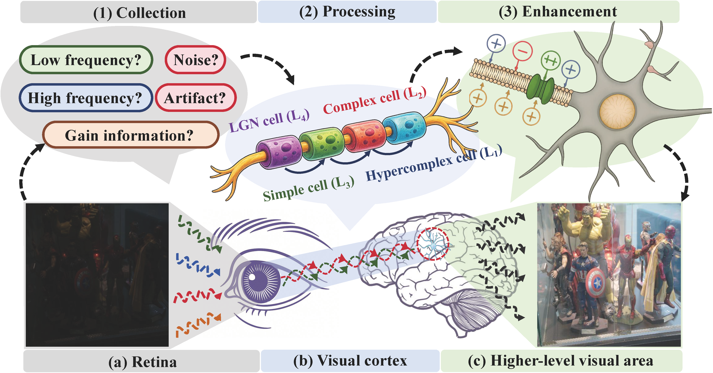
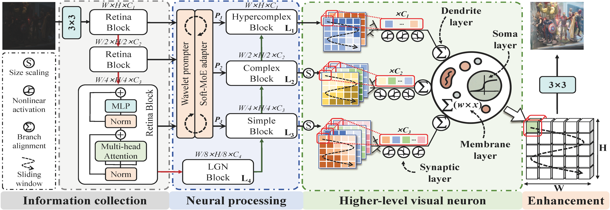

# WDNet: A Bio-Inspired Neural Network for Low-Light Image Enhancement

We have initially released the code for each module of WDNet. Upon publication of this paper, we will further release the complete WDNet model along with detailed usage instructions.

## Motivation

## Overall Structure of HGNet

## Intorduction
Low-light image enhancement (LLIE) aims to recover normal-light images that conform to human visual perception from degraded observations. However, most existing deep models still rely on experience-driven architectures and often treat the enhancement process as a black-box mapping from the pixel domain to the output. In contrast, the human visual system achieves stable low-light perception through a coordinated processing pathway, which can be functionally abstracted into retinal collecting, cortical processing, and nonlinear modulation in higher-level visual area. Motivated by this, we propose the wavelet-prompted dendritic neuron-driven network (WDNet), an end-to-end bio-inspired enhancement framework. Specifically, WDNet leverages a wavelet prompter and a cross-level Soft-MoE adapter to model progressive hierarchical processing and high-order feature interactions in the visual cortex. This not only captures long-range dependencies among multi-level features, but also reduces prompt redundancy and enhances attention to high-frequency salient regions. In addition, we design a dendritic-driven higher-level visual neuron (HVN) module to model neural computations in higher-level visual areas under low-light conditions (i.e., modulation, integration, and stable response), enabling nonlinear modulation and multi-scale integration. Extensive experiments on public benchmarks demonstrate that WDNet achieves competitive leading performance, while ablation results further verify the rationality of the proposed network architecture. 

